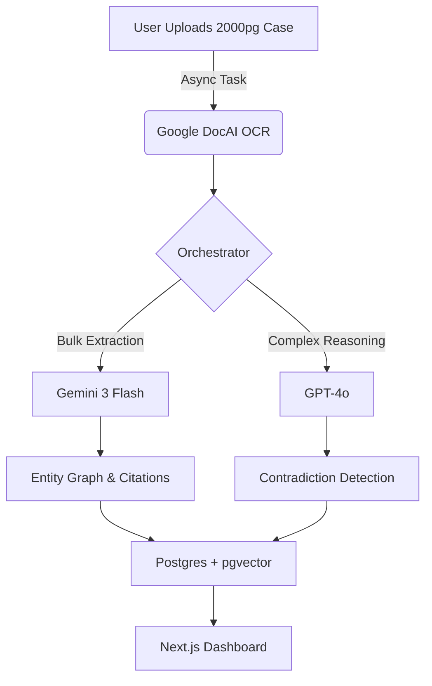

# Building LDIP: A Forensic Legal Reading Assistant
*From 2000+ page case files to verified insights in minutes.*

## 1. TL;DR
Litigation lawyers drown in thousands of unorganized case pages, making manual analysis slow and error-prone. I built **LDIP (Legal Document Intelligence Platform)**—a full-stack AI agent that ingests messy PDFs, extracts entities, verifies legal citations against Acts, and builds chronologies, cutting review time by ~90% at a cost of <$14 per matter.

## 2. Problem & Insight
**The Pain:** In high-stakes litigation, "missing a detail" isn't just an error—it's malpractice. Lawyers receive dump-trucks of unstructured data: scanned PDFs, annexures, and petitions.

**The Insight:** Existing tools are either simple "chat with PDF" wrappers (hallucination-prone) or expensive enterprise monoliths. There was no *forensic* tool that could rigorously verify citations ("Does this petition quote Section 65B correctly?") or map hidden relationships between entities across thousands of pages without breaking the bank.

**Why Now?** Multimodal models (Gemini 3 Flash) finally made OCR of Indian legal documents (often noisy scans) cheap and accurate, while reasoning models (GPT-4o) became capable of complex contradiction detection.

## 3. Solution Overview
LDIP is a vertically integrated "Legal Operating System" that combines forensic document processing with agentic reasoning.

### The Stack
*   **Frontend:** Next.js 16 (App Router), React 19, Tailwind CSS v4, Radix UI.
*   **Backend:** FastAPI (Python 3.12), Pydantic v2.
*   **Database:** Supabase PostgreSQL (with `pgvector` for semantic search).
*   **Infrastructure:** Celery + Redis (Async jobs), Vercel (FE), Railway (BE).
*   **AI Engine:** **Hybrid Routing Architecture**
    *   **Gemini 3 Flash:** Bulk "reading" tasks (OCR validation, Entity/Citation extraction).
    *   **GPT-4o:** High-stakes "thinking" tasks (Contradiction detection, user Q&A).
    *   **Cohere Rerank v3.5:** Precision retrieval for RAG.

### Key Workflows
1.  **Ingestion:** Drag-and-drop ZIPs/PDFs → Async Google DocAI OCR → Parent-Child Chunking → Hybrid Indexing (BM25 + pgvector).
2.  **Citation Engine:** Extracts Act citations → Checks "Act Library" → Verifies quoting accuracy → Highlights mismatches side-by-side.
3.  **Matter Identity Graph (MIG):** Extracts People/Orgs → Resolves Aliases (e.g., "N.D. Jobalia" = "Nirav Jobalia") → Builds a graph using relational tables (`identity_nodes`, `identity_edges`).
4.  **Security (4-Layer Isolation):**
    *   **Layer 1:** PostgreSQL RLS policies on every table.
    *   **Layer 2:** Vector namespaces prefixed by `matter_id`.
    *   **Layer 3:** Redis cache keys prefixed by `matter_id`.
    *   **Layer 4:** API middleware validation on every request.

## 4. What I Built: The Complete Feature Set

Over 14 epics and 80+ user stories, I implemented a production-ready legal intelligence platform. Here's what each component does:

### Foundation Layer (Epics 1-2)

**Authentication & Security (Epic 1)**
Built a complete auth system with Supabase: email/password login, JWT token handling, password reset flows, and a role-per-matter permission model (Owner/Editor/Viewer). Every database table has Row-Level Security policies ensuring lawyers only see their own cases.

**Document Processing Pipeline (Epic 2A-2C)**
The ingestion system handles the messy reality of legal documents:
- *Upload & Storage (2A):* Drag-and-drop UI accepting PDFs and ZIP archives, with files stored securely in Supabase Storage.
- *OCR & Search (2B):* Google Document AI extracts text with bounding boxes (for precise highlighting), Gemini validates low-confidence pages, documents are chunked into parent-child hierarchies (large chunks for context, small chunks for precision), and a hybrid search system combines BM25 keyword matching with pgvector semantic search—topped by Cohere reranking for the best results.
- *Entity Extraction (2C):* Gemini identifies people, organizations, and locations, resolves aliases automatically ("IPC" = "Indian Penal Code"), and background job tracking shows users real-time processing status.

### Intelligence Engines (Epics 3-7)

**Citation Verification Engine (Epic 3)**
The forensic heart of LDIP. When a petition claims "Section 65B(4) states X," the system:
1. Extracts all Act citations from documents using regex + Gemini
2. Shows an "Act Discovery Report"—which Acts are referenced but missing
3. After the user uploads the actual Act PDFs, verifies every quote against the source
4. Displays mismatches in a split-view: source document on the left, Act on the right, with bounding-box highlighting

**Timeline Construction (Epic 4)**
Automatically extracts dates from documents, classifies events (filing, hearing, judgment), links them to entities involved, and detects timeline anomalies (e.g., "response filed before petition?").

**Contradiction Detection (Epic 5)**
The "gotcha" finder. Groups all statements about a specific entity (e.g., "What does Document A say about Nirav Jobalia vs Document B?"), uses GPT-4o to compare statement pairs, and classifies contradictions by type and severity. Contradiction findings appear in the Verification Queue, Summary Attention Banner, Timeline event flags, and Export Builder—with a dedicated Contradictions Tab planned for Phase 2.

**Engine Orchestrator (Epic 6)**
When a user asks a question, the orchestrator analyzes intent (is this a citation question? timeline question? entity question?), routes to the appropriate engine(s)—sometimes in parallel—and maintains an audit trail of every AI decision for transparency.

**Three-Layer Memory System (Epic 7)**
- *Session Memory (Redis):* Short-term conversation context with TTL sliding windows and pronoun resolution ("What about him?" → knows "him" refers to the last-mentioned person)
- *Matter Memory (PostgreSQL):* Long-term storage of key findings, research notes, and verified facts per case
- *Query Cache:* Avoids redundant API calls for repeated questions

### Safety & Trust (Epic 8)

Lawyers cannot tolerate hallucinations. The safety layer implements:
- *Regex Pattern Detection:* Blocks dangerous queries ("Will I win?") before they reach the LLM
- *GPT-4o-mini Violation Detection:* Catches subtle policy violations the regex misses
- *Language Policing:* Post-processes LLM outputs to strip "legal advice" language (changes "This proves guilt" to "This document suggests...")
- *Verification Queue:* Findings above a confidence threshold must be reviewed and approved by a human before export

### User Experience (Epics 9-10)

**Dashboard & Upload Experience (Epic 9)**
A polished home screen with:
- Matter cards showing processing status at a glance
- Grid/list view toggle with sorting and filtering
- Activity feed showing recent actions across all matters
- A 5-stage upload wizard: file selection → validation → upload progress → live discovery feed (watch entities and citations appear in real-time) → completion with browser notifications

**Workspace Shell & Tabs (Epic 10A-10D)**
The main workspace where lawyers spend their time:
- *Shell (10A):* Header with editable matter name, export dropdown, share dialog, and a tab bar for navigation
- *Summary & Timeline (10B):* Summary tab with inline verification badges, timeline views (vertical list, horizontal track, multi-track by entity), filtering by event type, and manual event creation
- *Entities & Citations (10C):* Interactive MIG graph visualization (using React Flow), entity detail panel with merge capabilities, citations list with Act Discovery integration, and the split-view citation highlighting
- *Verification & Documents (10D):* Verification queue with filtering by finding type (including contradictions), bulk verification actions, document file list with inline actions

**Q&A Panel & PDF Viewer (Epic 11)** *(Mostly Complete)*
The conversational interface for exploring case files:
- Panel header with position controls (right sidebar, bottom panel, floating, hidden)
- Conversation history with streaming responses
- Engine trace visibility showing which AI engines were invoked
- Suggested questions for empty state
- PDF split-view for source references with bounding-box overlays
- Full-screen PDF modal with navigation and zoom

**Export Builder (Epic 12)** *(In Progress)*
Generate court-ready reports:
- Modal with section selection (Executive Summary, Timeline, Entities, Citations, Contradictions, Key Findings)
- Drag-and-drop section reordering
- Inline editing of section content
- Export preview panel

**MVP Gap Remediation (Epic 14)** *(In Progress)*
Critical fixes discovered during MVP validation:
- Summary API endpoint for dashboard
- Contradictions list API for verification queue
- Upload stage 3-4 real API wiring (replacing mocks)
- Dashboard activity feed and quick stats with real APIs

### What's Next (Epic 13 & Phase 2)

**In Backlog:**
- *Production Hardening (Epic 13):* Axiom logging, circuit breakers, rate limiting, graceful degradation, and deployment configs

**Phase 2 Features:**
- *Dedicated Contradictions Tab:* Entity-grouped display with side-by-side comparison (backend complete, UI deferred)
- *Documentation Gap Engine:* Auto-detect missing required documents (requires process templates from 5+ real matters)
- *Process Chain Engine:* Validate event sequences against legal procedure templates
- *Table Extraction:* Docling/TableFormer integration for structured data in PDFs
- *RAG Evaluation Framework:* Lawyer-verified golden datasets for quality measurement

## 5. Build Journey: Pivots & "Aha!" Moments

### The "Graph DB" Trap (Pivot)
**Initial thought:** "I need Neo4j for the entity graph!"
**Reality:** Managing a separate graph DB added massive complexity for simple queries.
**Solution:** Used PostgreSQL for *everything*. Implemented the graph using robust relational patterns (`identity_nodes`, `identity_edges`) and adjacency lists. It's faster, ACID-compliant, and simpler to secure with RLS. (See **ADR-001**).

### The Cost Barrier (Blocker)
**Blocker:** Running GPT-4 on every chunk of a 2000-page document cost ~$150+. Unviable.
**Unlock:** **Hybrid Model Routing (ADR-002)**.
*   **Gemini 3 Flash:** Used for bulk tasks like OCR validation (3.5-6x cheaper).
*   **GPT-4o:** Reserved only for complex reasoning (Contradictions).
**Result:** Dropped cost per matter from >$100 to **~$13.50**.

### The "Hallucination" Fear (Safety)
**Challenge:** Lawyers cannot tolerate made-up laws.
**Solution:** Implemented a **Safety Layer** with "Language Policing."
1.  **Guardrails:** Block dangerous queries ("Will I win?") via regex & classifier.
2.  **Policing:** Regex + LLM post-processing to strip "legal advice" language (e.g., changing "This proves guilt" to "This suggests potential liability").
3.  **Verification:** A dedicated UI where humans *must* verify AI findings (>70% confidence required) before export.

### The Orchestration Challenge (UX)
**Problem:** Deep reasoning takes 10+ seconds. Users hate waiting.
**Solution:** **Parallel Engine Execution**.
The **Orchestrator** determines which engines (Citation, Timeline, Contradiction) are needed based on the query intent and executes them in parallel. This significantly reduces total wait time compared to sequential processing, while the architecture facilitates future streaming enhancements.

## 6. Results & Metrics
*   **Scale:** 14 epics, 80+ stories, 4400+ tests passing (2200+ backend, 2200+ frontend)
*   **Efficiency:** <10 seconds to verified hybrid search results.
*   **Throughput:** Processes 100 pages in ~5 minutes.
*   **Cost:** **$13-14 per 2,000-page matter** (Target was <$15).
*   **Accuracy:** >95% recall on citation extraction; 4-layer isolation ensures 0% data leakage between cases.
*   **User Feedback:** "The split-view verification is a game changer—I don't have to flip between 10 PDFs anymore."

## 7. Learnings & Next Steps
**Learnings:**
*   **Structured Data > Chat:** Lawyers prefer structured tables (Timelines, Parties, Discrepancies) over open-ended chat.
*   **Agentic UX:** Show work! Displaying "Thinking...", intermediate steps, and confidence scores builds trust more than instant black-box answers.
*   **Test Everything:** With 4400+ tests across frontend and backend, I caught regressions early and shipped with confidence.

**Next Steps:**
*   **Complete Epic 12:** Finish Export Builder with verification checks and format generation
*   **Complete Epic 14:** Wire remaining dashboard APIs and frontend-backend integrations
*   **Production Hardening (Epic 13):** Logging, monitoring, rate limiting for public beta
*   **Public Beta:** Rolling out to 50 beta users in Q1 2026.

## 8. The Pitch

**The One-Liner:**
> "LDIP is your paranoid junior associate who reads every page, checks every citation, and never misses a contradiction—for $14 a case."

**The Story (30 seconds):**
> A lawyer uploads a 2000-page case file. By the time they make coffee, LDIP has found that the opposing petition misquoted Section 65B on page 234, the key witness contradicted himself between his affidavit and deposition, and the timeline shows a document was supposedly signed two days before it existed. That's $14 and 10 minutes vs. a junior associate billing 40 hours.

**The Problem:**
> Litigation lawyers spend 40% of their time manually reviewing thousands of pages—checking citations, tracking entities, finding contradictions. Miss one detail = malpractice. Current tools are either "chat with PDF" wrappers that hallucinate, or enterprise monoliths costing $50K+/year.

**The Solution:**
> LDIP does forensic case prep in minutes for $14/matter—not $150+ in associate hours.

**What LDIP Does:**
1. **Ask anything about your case** — Natural language queries with answers traced to exact pages
2. **Ingests messy documents** — Scanned PDFs, annexures, handwritten notes → clean searchable text
3. **Extracts & resolves entities** — Knows "N.D. Jobalia" = "Nirav Jobalia" across 2000 pages
4. **Verifies citations** — Checks if quoted sections actually say what the petition claims
5. **Builds timelines** — Auto-extracts dates, detects sequence anomalies
6. **Finds contradictions** — "Document A says X, but Document B says Y about the same person"
7. **Maintains audit trails** — Every AI finding is traceable to source document, page, and bounding box

**What Makes It Different:**
> *"Other tools help you search. LDIP helps you verify. It's the difference between finding case law and catching where your opponent misquoted it."*

**Traction:**
> 2 pilot clients in litigation. Working product with 14 epics, 80+ stories, 4400+ tests. Ready for 50-user beta in Q1 2026.

**The Ask:**
> Looking for early adopter law firms handling document-heavy litigation to validate and refine the product.

**The Promise:**
> What if you could walk into court knowing you've found every hole in the other side's story? That's LDIP.

---

## 9. Competitive Landscape

### How LDIP Compares to Indian Legal AI Tools

| Feature | **LDIP** | **jhana** | **Vettam AI** | **VetoAI** |
|---------|----------|-----------|---------------|------------|
| **Primary Focus** | Forensic case prep | Legal research & archive | Research & drafting | Document analysis |
| **Citation Verification** | ✅ Verifies against source | ❌ Links only | ❌ Cites only | ❌ Finds only |
| **Contradiction Detection** | ✅ Cross-doc comparison | ⚠️ Basic | ❌ No | ❌ No |
| **Entity Resolution** | ✅ Alias graph (MIG) | ❌ No | ❌ No | ⚠️ Extraction only |
| **Timeline Analysis** | ✅ With anomaly detection | ❌ No | ❌ No | ❌ No |
| **Document Database** | Per-matter (user uploads) | 16M+ judgments | Unknown | Unknown |
| **OCR for Indian Scans** | ✅ DocAI + Gemini | ✅ Yes | Unknown | Unknown |
| **Pricing** | **$14/matter** | Free + paid tiers | Hidden | Hidden |
| **Audit Trail** | ✅ Full traceability | ⚠️ Partial | Unknown | Unknown |

### LDIP's Positioning

| What Others Do | What LDIP Does |
|----------------|----------------|
| *Find case law* | *Verify accuracy of cited case law* |
| *Extract entities* | *Resolve aliases & build relationship graphs* |
| *Summarize documents* | *Find contradictions across documents* |
| *Chat with PDF* | *Structured forensic analysis* |
| *Enterprise pricing* | *$14/matter—accessible to all* |

### The Moat

LDIP isn't competing on "better search." It's competing on **forensic verification**—something lawyers currently do manually or not at all. The combination of citation verification + entity resolution + contradiction detection + timeline analysis in one tool doesn't exist in the Indian legal AI market today.

---

## 10. Team & Roles
*   **Juhi:** Solo Full-Stack Engineer (Product, Design, Backend, Frontend, DevOps).
*   **Mentorship:** 100xEngineers (Guidance on Agentic Architecture & LLM patterns).

## 11. Resources & Inspirations
*   **100xEngineers:** For the "Agentic" mindset and rigorous curriculum.
*   **Supabase:** For making Postgres RLS & Vector search seamless.
*   **Vercel/Railway:** For infrastructure that just works.
