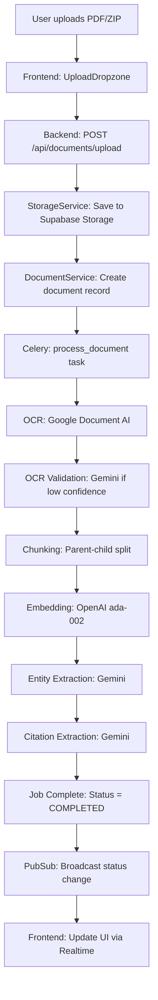
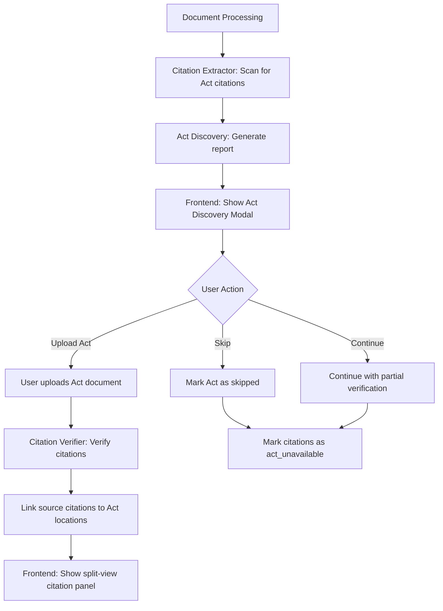
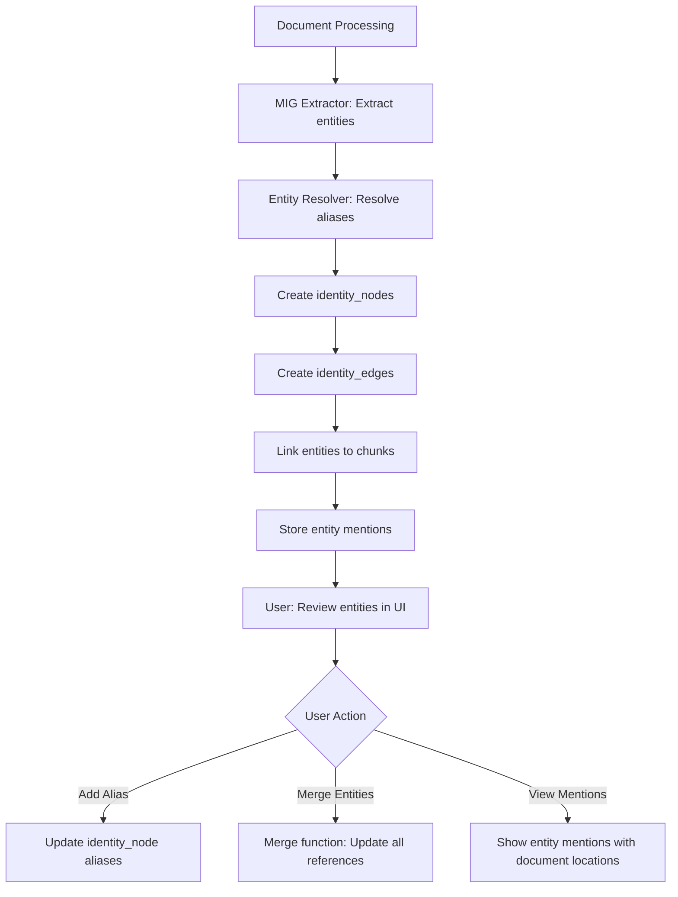
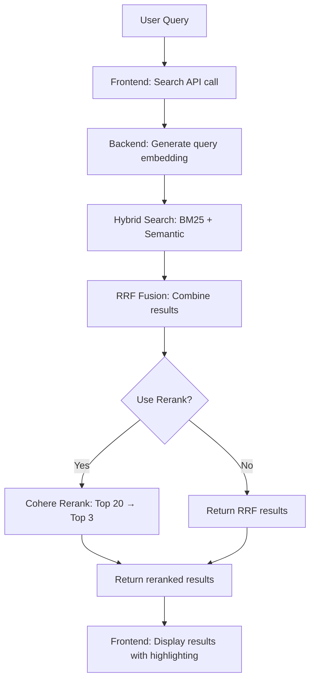

# LDIP Project Analysis

**Legal Document Intelligence Platform - Comprehensive Implementation Analysis**

**Date:** 2026-01-14  
**Purpose:** Complete technical and product overview for new team members and stakeholders

---

## Executive Summary

- **LDIP** is an AI-powered legal document analysis platform that helps lawyers analyze complex litigation documents, verify citations, extract entities, and build timelines automatically
- **Current Status:** MVP Phase 1 implementation is ~70% complete with core document processing, OCR, citation extraction, and entity extraction working
- **Architecture:** Next.js frontend (React 19), FastAPI backend (Python 3.12), Supabase PostgreSQL database with pgvector, Celery for background jobs
- **Key Features Implemented:** Document upload with ZIP support, Google Document AI OCR, Gemini OCR validation, parent-child chunking, hybrid search (BM25 + semantic), citation extraction, Act discovery workflow, entity extraction with MIG graph, background job tracking
- **Security:** Four-layer matter isolation enforced via RLS policies, vector namespaces, Redis key prefixes, and API middleware validation
- **AI Services:** Hybrid LLM strategy - Gemini 3 Flash for bulk ingestion tasks, GPT-4 for reasoning/user-facing tasks, Cohere Rerank for search refinement
- **Missing Features:** Timeline construction engine, consistency/contradiction detection engine, Q&A chat interface, research journal, query guardrails, language policing
- **Database:** 25 migration files creating 15+ tables with comprehensive RLS policies for matter isolation
- **Deployment:** Frontend on Vercel, backend on Railway, Supabase for database/storage, Redis for Celery broker
- **Next Steps:** Complete remaining engines (timeline, contradiction), implement Q&A interface, add safety layer (query guardrails, language policing), build research journal

---

## For Engineers

### Architecture Overview

LDIP follows a three-tier architecture with clear separation of concerns:

```
┌─────────────────────────────────────────────────────────────┐
│                    FRONTEND LAYER                           │
│  Next.js 16 App Router + React 19 + TypeScript + Tailwind  │
│  - Authentication (Supabase Auth SSR)                       │
│  - Document upload UI                                       │
│  - Citation analysis UI                                     │
│  - PDF viewer with bbox highlighting                        │
│  - Processing status dashboard                             │
└─────────────────────────────────────────────────────────────┘
                            ↓ HTTP/REST API
┌─────────────────────────────────────────────────────────────┐
│                    API LAYER                                │
│  FastAPI 0.128+ (Python 3.12)                              │
│  - REST endpoints with Pydantic v2 models                   │
│  - JWT authentication via Supabase                         │
│  - Role-based access control (owner/editor/viewer)          │
│  - Matter isolation middleware                              │
└─────────────────────────────────────────────────────────────┘
                            ↓
┌─────────────────────────────────────────────────────────────┐
│              BUSINESS LOGIC & SERVICES                      │
│  - Document Service (CRUD operations)                      │
│  - OCR Service (Google Document AI + Gemini validation)     │
│  - Chunking Service (parent-child hierarchical)            │
│  - RAG Service (hybrid search + embeddings)                 │
│  - Citation Engine (extraction + verification)              │
│  - MIG Service (entity extraction + graph)                  │
│  - Job Tracking Service (Celery integration)               │
└─────────────────────────────────────────────────────────────┘
                            ↓
┌─────────────────────────────────────────────────────────────┐
│                    DATA LAYER                               │
│  Supabase PostgreSQL (pgvector enabled)                    │
│  - 15+ tables with RLS policies                            │
│  - Vector embeddings for semantic search                    │
│  - Supabase Storage for PDF files                          │
│  Redis (Upstash) - Celery broker + caching                 │
└─────────────────────────────────────────────────────────────┘
```

**Key Architectural Decisions:**

1. **PostgreSQL-only approach** - No Neo4j for MIG graph (simpler security, sufficient performance)
2. **Hybrid LLM routing** - Gemini for bulk tasks ($0.001/1K tokens), GPT-4 for reasoning ($0.03/1K tokens)
3. **Parent-child chunking** - 1500-2000 token parents, 400-700 token children for precise retrieval
4. **Four-layer matter isolation** - RLS + vector namespaces + Redis prefixes + API validation
5. **Celery for async processing** - Background jobs for OCR, chunking, embedding, extraction

### Database Schema

**Core Tables:**

1. **`users`** - User profiles extending Supabase auth.users
2. **`matters`** - Legal matters/cases (soft-delete support)
3. **`matter_attorneys`** - Role assignments (owner/editor/viewer per matter)
4. **`documents`** - Uploaded PDF files with processing status
5. **`bounding_boxes`** - OCR text positions for highlighting (x, y, width, height normalized 0-100)
6. **`chunks`** - Document chunks with vector embeddings (parent-child hierarchy)
7. **`citations`** - Act citations extracted from documents (source + target linking)
8. **`act_resolutions`** - Tracks which Acts are available/missing per matter
9. **`identity_nodes`** - Canonical entities (persons, organizations, locations)
10. **`identity_edges`** - Relationships between entities
11. **`entity_mentions`** - Specific mentions of entities in documents
12. **`events`** - Timeline events extracted from documents
13. **`findings`** - Engine outputs requiring attorney verification
14. **`matter_memory`** - Persistent matter-level JSONB storage
15. **`processing_jobs`** - Background job tracking with stage history
16. **`job_stage_history`** - Granular stage-level progress tracking
17. **`ocr_validation_results`** - OCR quality assessment per page
18. **`alias_corrections`** - Manual entity alias corrections for learning

**Key Relationships:**

- All tables with `matter_id` have RLS policies enforcing matter access
- Documents → Chunks → Bounding Boxes (many-to-many via arrays)
- Documents → Citations → Act Documents (for verification)
- Identity Nodes → Identity Edges (graph structure)
- Documents → Events (timeline extraction)
- Documents → Processing Jobs (background task tracking)

**RLS Policy Pattern:**

Every table with `matter_id` uses this pattern:
```sql
CREATE POLICY "Users can view X from their matters"
ON table_name FOR SELECT
USING (
  matter_id IN (
    SELECT matter_id FROM matter_attorneys
    WHERE user_id = auth.uid()
  )
);
```

### API Endpoints

**Implemented Endpoints:**

**Matters (`/api/matters`):**
- `POST /api/matters` - Create matter (auto-assigns creator as owner)
- `GET /api/matters` - List user's matters (paginated, filtered by status)
- `GET /api/matters/{matter_id}` - Get matter details
- `PATCH /api/matters/{matter_id}` - Update matter (editors/owners)
- `DELETE /api/matters/{matter_id}` - Soft-delete matter (owners only)
- `GET /api/matters/{matter_id}/members` - List matter members
- `POST /api/matters/{matter_id}/members` - Invite member
- `PATCH /api/matters/{matter_id}/members/{user_id}` - Update member role
- `DELETE /api/matters/{matter_id}/members/{user_id}` - Remove member

**Documents (`/api/documents`):**
- `POST /api/documents/upload` - Upload single file or ZIP
- `GET /api/matters/{matter_id}/documents` - List documents (paginated, filtered, sorted)
- `GET /api/documents/{document_id}` - Get document details
- `PATCH /api/documents/{document_id}` - Update document metadata
- `DELETE /api/documents/{document_id}` - Delete document
- `POST /api/documents/{document_id}/bulk-update` - Bulk update multiple documents
- `GET /api/documents/{document_id}/quality` - Get OCR quality assessment
- `POST /api/documents/{document_id}/manual-review` - Request manual review for pages

**Citations (`/api/citations`):**
- `GET /api/matters/{matter_id}/citations` - List citations (paginated, filtered by Act)
- `GET /api/matters/{matter_id}/citations/discovery` - Get Act Discovery Report
- `POST /api/matters/{matter_id}/citations/acts/uploaded` - Mark Act as uploaded
- `POST /api/matters/{matter_id}/citations/acts/skipped` - Mark Act as skipped
- `GET /api/matters/{matter_id}/citations/summary` - Get citation summary by Act
- `GET /api/citations/{citation_id}` - Get citation details
- `POST /api/citations/{citation_id}/verify` - Verify single citation
- `POST /api/citations/verify-batch` - Verify multiple citations

**Search (`/api/matters/{matter_id}/search`):**
- `POST /api/matters/{matter_id}/search/hybrid` - Hybrid search (BM25 + semantic)
- `POST /api/matters/{matter_id}/search/bm25` - BM25 keyword search only
- `POST /api/matters/{matter_id}/search/semantic` - Semantic vector search only
- `POST /api/matters/{matter_id}/search/reranked` - Hybrid + Cohere Rerank
- `POST /api/matters/{matter_id}/search/alias-expanded` - Search with entity alias expansion

**Entities (`/api/matters/{matter_id}/entities`):**
- `GET /api/matters/{matter_id}/entities` - List entities (paginated, filtered by type)
- `GET /api/matters/{matter_id}/entities/{entity_id}` - Get entity with relationships
- `GET /api/matters/{matter_id}/entities/{entity_id}/mentions` - Get entity mentions
- `POST /api/matters/{matter_id}/entities/{entity_id}/aliases` - Add alias
- `DELETE /api/matters/{matter_id}/entities/{entity_id}/aliases` - Remove alias
- `POST /api/matters/{matter_id}/entities/merge` - Merge two entities

**Jobs (`/api/jobs`):**
- `GET /api/matters/{matter_id}/jobs` - List processing jobs
- `GET /api/jobs/{job_id}` - Get job details with stage history
- `GET /api/matters/{matter_id}/jobs/stats` - Get job queue statistics
- `POST /api/jobs/{job_id}/retry` - Retry failed job
- `POST /api/jobs/{job_id}/skip` - Skip job
- `POST /api/jobs/{job_id}/cancel` - Cancel running job

**Health (`/api/health`):**
- `GET /api/health` - Basic health check
- `GET /api/health/ready` - Readiness probe (checks database)
- `GET /api/health/live` - Liveness probe

**Not Yet Implemented:**
- Timeline engine endpoints
- Consistency/contradiction engine endpoints
- Q&A chat endpoints
- Query guardrails endpoints

### Services & Engines

**Document Processing Pipeline:**

1. **Storage Service** (`app/services/storage_service.py`)
   - Handles Supabase Storage operations
   - ZIP extraction with rollback on failure
   - Folder structure: `documents/{matter_id}/uploads/{filename}`

2. **OCR Service** (`app/services/ocr/processor.py`)
   - Google Document AI integration
   - Multi-language support (English, Hindi, Gujarati)
   - Bounding box extraction with reading order
   - Confidence scores per page

3. **OCR Validation Service** (`app/services/ocr/gemini_validator.py`)
   - Gemini 3 Flash for low-confidence OCR correction
   - Pattern-based corrections before LLM calls
   - Human review queue for <50% confidence pages

4. **Chunking Service** (`app/services/chunking/parent_child_chunker.py`)
   - Parent chunks: 1500-2000 tokens (context)
   - Child chunks: 400-700 tokens (precise retrieval)
   - Overlap handling between chunks
   - Bounding box linking for visual highlighting

5. **Embedding Service** (`app/services/rag/embedder.py`)
   - OpenAI ada-002 embeddings (1536 dimensions)
   - Batch processing (50 chunks per call)
   - Matter-isolated namespace validation

6. **Hybrid Search Service** (`app/services/rag/hybrid_search.py`)
   - BM25 keyword search via PostgreSQL tsvector
   - Semantic search via pgvector HNSW index
   - Reciprocal Rank Fusion (RRF) for merging
   - Cohere Rerank v3.5 for top-N refinement (graceful fallback)

**Citation Engine** (`app/engines/citation/`):

1. **Citation Extractor** (`extractor.py`)
   - Extracts Act citations from documents
   - Normalizes Act names for matching
   - Links citations to bounding boxes

2. **Act Discovery Service** (`act_indexer.py`)
   - Generates Act Discovery Report
   - Tracks which Acts are available/missing
   - User workflow: upload missing Acts or skip

3. **Citation Verifier** (`verifier.py`)
   - Verifies citations against uploaded Act documents
   - Detects text mismatches
   - Links source citations to target Act locations

**MIG (Matter Identity Graph) Service** (`app/services/mig/`):

1. **Entity Extractor** (`extractor.py`)
   - Gemini 3 Flash for entity extraction
   - Extracts persons, organizations, locations, dates
   - Creates identity_nodes and identity_edges

2. **Entity Resolver** (`entity_resolver.py`)
   - Alias resolution (name variant matching)
   - Indian naming pattern support
   - Manual correction learning

3. **Graph Service** (`graph.py`)
   - Entity CRUD operations
   - Relationship management
   - Entity merging with reference updates

**Job Tracking Service** (`app/services/job_tracking/`):

1. **Job Tracker** (`tracker.py`)
   - Creates processing jobs
   - Updates job status and progress
   - Records stage history

2. **Partial Progress Tracker** (`partial_progress.py`)
   - Preserves progress on failure
   - Enables resume from last checkpoint

3. **Time Estimator** (`time_estimator.py`)
   - Estimates completion time based on historical data
   - Updates estimates as stages complete

### Data Flow Diagrams

**Document Upload → Processing Flow:**



**Citation Extraction → Verification Flow:**



**Entity Extraction → MIG Graph Flow:**



**Search Flow:**



### Implementation Status

**Completed (Epic 1-3):**

✅ **Epic 1: Authentication & Authorization**
- Supabase Auth integration (email/password, magic link, Google OAuth)
- JWT token handling
- Password reset flow
- Role-per-matter model (owner/editor/viewer)
- RLS policies on all tables

✅ **Epic 2A: Document Upload & Storage**
- Drag-drop upload UI
- ZIP file extraction
- Supabase Storage integration
- Document CRUD endpoints
- Document list with filtering/sorting

✅ **Epic 2B: OCR & RAG Pipeline**
- Google Document AI OCR
- Gemini OCR validation
- OCR quality assessment
- Bounding boxes table with reading order
- Parent-child chunking
- Hybrid search (BM25 + pgvector)
- Cohere Rerank integration

✅ **Epic 2C: Entity Extraction & MIG**
- MIG entity extraction
- Alias resolution
- Background job tracking
- Processing status UI

✅ **Epic 3: Citation Engine**
- Citation extraction
- Act Discovery Report UI
- Citation verification
- Split-view citation highlighting

**In Progress / Planned:**

⏳ **Epic 4: Timeline Construction Engine** (Not started)
- Event extraction from documents
- Timeline visualization
- Sequence validation

⏳ **Epic 5: Consistency & Contradiction Engine** (Not started)
- Cross-document comparison
- Contradiction detection
- Inconsistency reporting

⏳ **Epic 6: Q&A Interface** (Not started)
- Query processing
- Response generation
- Evidence linking

⏳ **Epic 7: Safety Layer** (Not started)
- Query guardrails
- Language policing
- Attorney verification workflow

⏳ **Epic 8: Research Journal** (Not started)
- Save findings
- Personal notes
- Export functionality

### Technical Risks & Complexity

**High Complexity Areas:**

1. **Matter Isolation** - Four-layer enforcement is complex but critical for legal ethics
   - Risk: Cross-matter data leakage
   - Mitigation: Automated penetration testing, RLS policies, vector namespace validation

2. **OCR Quality** - Legal documents have poor scan quality, handwritten text, multilingual content
   - Risk: Low accuracy leading to incorrect citations/extractions
   - Mitigation: Multi-stage validation (pattern correction → Gemini → human review)

3. **LLM Cost Control** - GPT-4 is 30x more expensive than Gemini
   - Risk: Cost overruns on large matters
   - Mitigation: Strict routing rules, batch processing, caching

4. **Background Job Reliability** - Long-running processing tasks can fail
   - Risk: Lost progress, retry storms
   - Mitigation: Partial progress preservation, exponential backoff, job tracking

5. **Vector Search Performance** - Large matters with thousands of chunks
   - Risk: Slow query response times
   - Mitigation: HNSW index, matter-scoped queries, result limits

**Known Technical Debt:**

1. **Service Client vs Anon Client** - Inconsistent usage patterns (documented, needs standardization)
2. **Async/Sync Mismatches** - Some Celery tasks need `asyncio.to_thread()` adaptation
3. **Error Handling** - Some services need more granular error types
4. **Testing Coverage** - Frontend tests are minimal (backend has good coverage)

**Performance Considerations:**

- Document processing: ~5 minutes per 100 pages (target met)
- Query response: <10 seconds for hybrid search (target met)
- UI page load: <2 seconds (target met)
- Cost per matter: ~$13-14 per 2000 pages (target: <$15)

---

## For Product Managers

### What LDIP Does Today

LDIP is a **forensic reading assistant** for lawyers working on complex litigation cases. It helps attorneys:

1. **Upload and Process Documents**
   - Upload PDF files or ZIP archives containing case documents
   - Automatically extract text using OCR (supports English, Hindi, Gujarati)
   - Validate OCR quality and flag pages needing manual review
   - Process documents in the background with real-time status updates

2. **Extract and Verify Citations**
   - Automatically finds all Act citations in uploaded documents (e.g., "Indian Evidence Act Section 65B")
   - Shows which Acts are referenced and which are missing
   - Lets users upload missing Act documents
   - Verifies citations against actual Act text
   - Highlights mismatches between what documents claim and what Acts actually say
   - Provides split-view interface showing source citation and matching Act text side-by-side

3. **Extract Entities and Build Relationships**
   - Automatically identifies people, organizations, locations, dates mentioned in documents
   - Resolves name variants (e.g., "Nirav Jobalia" = "N.D. Jobalia" = "Nirav D. Jobalia")
   - Builds a graph showing relationships between entities
   - Lets users review, merge, and correct entity information

4. **Search Documents**
   - Semantic search: "Find documents mentioning ownership disputes"
   - Keyword search: "Find exact phrase 'benami shares'"
   - Hybrid search: Combines both approaches for best results
   - Results show exact page numbers and can highlight text in PDF viewer

5. **Track Processing Status**
   - Real-time updates on document processing progress
   - See which documents are queued, processing, completed, or failed
   - Retry failed jobs with one click
   - View detailed stage-by-stage progress

### User Flows

**Flow 1: New Matter Setup**

1. User logs in (email/password, magic link, or Google OAuth)
2. Creates a new matter (e.g., "Nirav Jobalia Share Sale Case")
3. Invites team members with roles (owner/editor/viewer)
4. Uploads case documents (petitions, replies, annexures, etc.)
5. System processes documents automatically (OCR → chunking → entity extraction → citation extraction)
6. User sees processing status in real-time

**Flow 2: Citation Verification**

1. After documents are processed, system extracts all Act citations
2. System shows "Act Discovery Report" listing which Acts are referenced
3. User sees: "6 Acts referenced, 2 available, 4 missing"
4. User uploads missing Act documents (e.g., "Torts Act 1992.pdf")
5. System verifies citations against uploaded Acts
6. User reviews verified citations in split-view panel
7. User sees mismatches highlighted (e.g., "Document claims Section 12 says X, but Act says Y")

**Flow 3: Entity Review**

1. After processing, system extracts entities (people, organizations, etc.)
2. User views entity list filtered by type (person, organization, location)
3. User sees entity mentions with document locations
4. User adds aliases for name variants (e.g., "N.D. Jobalia" → alias for "Nirav Jobalia")
5. User merges duplicate entities if system created separate entries
6. User views entity relationships graph

**Flow 4: Document Search**

1. User enters query: "Any lapses on custodian's part?"
2. System performs hybrid search (keyword + semantic)
3. System shows top results with page numbers
4. User clicks result → PDF viewer opens to relevant page
5. User sees highlighted text matching the query

### Key Features Implemented

**Core Features:**

✅ **Multi-user Collaboration**
- Role-based access (owner can manage members, editor can upload/edit, viewer can read)
- Matter-level isolation (users only see matters they're members of)
- Invite workflow for adding team members

✅ **Document Management**
- Upload single files or ZIP archives
- Automatic ZIP extraction
- Document type classification (case_file, act, annexure, other)
- Document list with filtering, sorting, pagination
- Bulk operations (update multiple documents)

✅ **OCR Processing**
- Google Document AI for high-quality OCR
- Multi-language support (English, Hindi, Gujarati)
- OCR quality assessment per page
- Manual review queue for low-confidence pages
- Pattern-based corrections before LLM validation

✅ **Citation Analysis**
- Automatic citation extraction from documents
- Act Discovery Report showing which Acts are needed
- Citation verification against uploaded Act documents
- Split-view interface showing source vs. Act text
- Mismatch detection and highlighting

✅ **Entity Extraction**
- Automatic extraction of people, organizations, locations, dates
- Alias resolution for name variants
- Entity relationship graph
- Manual correction and merging

✅ **Search**
- Hybrid search (combines keyword and semantic)
- BM25 keyword search
- Semantic vector search
- Cohere Rerank for relevance refinement
- Alias-expanded search (includes entity name variants)

✅ **Background Processing**
- Real-time job status updates
- Stage-by-stage progress tracking
- Retry failed jobs
- Skip or cancel jobs
- Queue statistics dashboard

### What's Missing/Incomplete

**Critical Missing Features:**

❌ **Timeline Construction Engine**
- Should extract events from documents and build chronological timeline
- Should detect timeline anomalies (e.g., "Process took 9 months vs typical 2-3 months")
- Should validate event sequences
- **Status:** Not started, planned for Epic 4

❌ **Consistency & Contradiction Engine**
- Should detect contradictions across documents (e.g., "Party A claims X in Document 1, but Y in Document 5")
- Should identify inconsistencies in facts
- Should flag conflicting narratives
- **Status:** Not started, planned for Epic 5

❌ **Q&A Chat Interface**
- Should allow natural language queries (e.g., "Any lapses on custodian's part?")
- Should synthesize results from multiple engines
- Should provide evidence-bound answers with citations
- **Status:** Not started, planned for Epic 6

❌ **Safety Layer**
- Query guardrails to block dangerous legal questions
- Language policing to prevent legal conclusions in outputs
- Attorney verification workflow for findings
- **Status:** Not started, planned for Epic 7

❌ **Research Journal**
- Save findings for later review
- Personal notes and annotations
- Export findings to court documents
- **Status:** Not started, planned for Epic 8

**UI/UX Gaps:**

- Dashboard is placeholder (Epic 9 planned)
- Matter workspace is basic (needs tabbed interface)
- No timeline visualization
- No contradiction highlighting UI
- No Q&A chat interface
- No research journal UI

**Known Limitations:**

1. **Process Chain Integrity Engine** - Deferred to Phase 2 (requires user-created process templates from 5+ real matters)
2. **Documentation Gap Engine** - Deferred to Phase 2 (same reason)
3. **Cross-matter Analysis** - Blocked in MVP (strict isolation), planned for Phase 2+
4. **Act Library** - No global Act library (users must upload Acts per matter)

### Suggested Next Steps

**For Product Team:**

1. **Prioritize Remaining Engines**
   - Timeline Engine (Epic 4) - High value for case orientation
   - Consistency Engine (Epic 5) - High value for finding contradictions
   - Q&A Interface (Epic 6) - High value for user experience

2. **User Testing**
   - Test with real law firms on actual cases
   - Gather feedback on citation verification workflow
   - Validate entity extraction accuracy
   - Test search relevance

3. **Safety & Compliance**
   - Implement query guardrails (Epic 7)
   - Add language policing
   - Build attorney verification workflow
   - Document compliance with legal ethics requirements

4. **UX Improvements**
   - Build dashboard with matter overview
   - Add timeline visualization
   - Improve matter workspace with tabs
   - Add research journal UI

5. **Performance Optimization**
   - Monitor query response times
   - Optimize vector search for large matters
   - Reduce LLM costs through better caching
   - Improve background job reliability

**Questions for Engineering Team:**

1. **Timeline Engine:** What's the estimated timeline for Epic 4? What dependencies exist?
2. **Contradiction Engine:** How will we detect contradictions? What's the technical approach?
3. **Q&A Interface:** What LLM will we use? How will we synthesize results from multiple engines?
4. **Safety Layer:** How will query guardrails work? What's the language policing implementation?
5. **Performance:** Are we meeting targets? What optimizations are needed?
6. **Cost:** What's the actual cost per matter? Are we staying within budget?

**Questions for Legal/Compliance:**

1. **Ethics:** Does LDIP comply with bar association rules? Any concerns?
2. **Privacy:** How do we handle privileged documents? What's the privilege scanning status?
3. **Audit:** What audit trail do we need for court defensibility?
4. **Verification:** What verification workflow do attorneys need?

---

## Configuration & Deployment

### Environment Variables

**Frontend (`.env.local`):**
```bash
NEXT_PUBLIC_SUPABASE_URL=https://your-project.supabase.co
NEXT_PUBLIC_SUPABASE_ANON_KEY=your-anon-key
NEXT_PUBLIC_API_URL=http://localhost:8000  # Backend API URL
```

**Backend (`.env`):**
```bash
# Application
DEBUG=true
API_VERSION=v1

# Supabase
SUPABASE_URL=https://your-project.supabase.co
SUPABASE_KEY=your-anon-key
SUPABASE_SERVICE_KEY=your-service-role-key
SUPABASE_JWT_SECRET=your-jwt-secret

# Redis
REDIS_URL=redis://localhost:6379/0
CELERY_BROKER_URL=redis://localhost:6379/1
CELERY_RESULT_BACKEND=redis://localhost:6379/2

# LLM APIs
OPENAI_API_KEY=sk-...
GOOGLE_API_KEY=...
COHERE_API_KEY=...

# Google Cloud (Document AI)
GOOGLE_CLOUD_PROJECT_ID=your-project-id
GOOGLE_CLOUD_LOCATION=us
GOOGLE_DOCUMENT_AI_PROCESSOR_ID=your-processor-id
GOOGLE_APPLICATION_CREDENTIALS=/path/to/service-account.json

# CORS
CORS_ORIGINS=http://localhost:3000
```

### Supabase Setup

**Required Migrations:**
- Run all 25 migration files in `supabase/migrations/` in order
- Migrations create tables, indexes, RLS policies, and helper functions

**Storage Buckets:**
- Create bucket: `documents` (public access disabled)
- Storage policies are created in migration `20260106000010_create_storage_policies.sql`

**Authentication:**
- Enable Email provider (default)
- Enable Google OAuth (requires OAuth credentials)
- Configure redirect URLs: `http://localhost:3000/auth/callback`

**RLS Policies:**
- All policies are created via migrations
- Test RLS by creating test users and verifying matter isolation

### External Service Dependencies

**Google Cloud (Document AI):**
1. Create Google Cloud project
2. Enable Document AI API
3. Create processor for OCR
4. Create service account with Document AI permissions
5. Download service account JSON key
6. Set `GOOGLE_APPLICATION_CREDENTIALS` environment variable

**OpenAI:**
1. Create OpenAI account
2. Generate API key
3. Add to `OPENAI_API_KEY` environment variable
4. Used for: embeddings (ada-002), reasoning tasks (GPT-4)

**Google (Gemini):**
1. Create Google AI Studio account
2. Generate API key
3. Add to `GOOGLE_API_KEY` environment variable
4. Used for: OCR validation, entity extraction, citation extraction

**Cohere:**
1. Create Cohere account
2. Generate API key
3. Add to `COHERE_API_KEY` environment variable
4. Used for: Rerank v3.5 (search relevance refinement)

**Redis:**
- Local: `redis://localhost:6379`
- Production: Upstash Redis (serverless, pay-per-request)
- Used for: Celery broker, result backend, caching

### Deployment Architecture

**Frontend (Vercel):**
- Framework: Next.js 16
- Build command: `npm run build`
- Output directory: `.next`
- Environment variables: Set in Vercel dashboard
- Domain: Configure custom domain in Vercel

**Backend (Railway):**
- Runtime: Python 3.12
- Start command: `uvicorn app.main:app --host 0.0.0.0 --port $PORT`
- Environment variables: Set in Railway dashboard
- Health check: `/api/health/ready`

**Celery Workers (Railway):**
- Same codebase as backend
- Start command: `celery -A app.workers.celery worker --loglevel=info`
- Environment variables: Same as backend
- Scale: 1-3 workers depending on load

**Database (Supabase):**
- Managed PostgreSQL with pgvector extension
- Automatic backups
- Point-in-time recovery
- Connection pooling

**Storage (Supabase Storage):**
- S3-compatible object storage
- Organized by matter_id folders
- RLS policies enforce access control

**Redis (Upstash):**
- Serverless Redis
- Pay-per-request pricing
- Automatic scaling

### Local Development Setup

**Prerequisites:**
- Node.js 20+
- Python 3.12+
- `uv` package manager
- Redis (local or Upstash)
- Supabase account

**Frontend Setup:**
```bash
cd frontend
npm install
cp .env.local.example .env.local
# Edit .env.local with your Supabase credentials
npm run dev
```

**Backend Setup:**
```bash
cd backend
cp .env.example .env
# Edit .env with your credentials
uv sync --dev
uv run uvicorn app.main:app --reload --host 0.0.0.0 --port 8000
```

**Celery Worker Setup:**
```bash
cd backend
uv run celery -A app.workers.celery worker --loglevel=info
```

**Database Setup:**
```bash
# Using Supabase CLI
supabase start
supabase db reset  # Runs all migrations
```

---

## File Reference Guide

**Key Files for Understanding:**

**Architecture:**
- `_bmad-output/architecture.md` - Architecture decision document
- `_bmad-output/project-context.md` - Implementation rules and patterns
- `docs/LDIP_PITCH_DOCUMENT.md` - Product vision and requirements

**Backend:**
- `backend/app/main.py` - FastAPI application entry point
- `backend/app/api/routes/` - All API endpoint definitions
- `backend/app/services/` - Business logic services
- `backend/app/engines/citation/` - Citation engine implementation
- `backend/app/workers/tasks/document_tasks.py` - Background job tasks

**Frontend:**
- `frontend/src/app/` - Next.js App Router pages
- `frontend/src/components/features/` - Feature components
- `frontend/src/lib/api/` - API client functions
- `frontend/src/stores/` - Zustand state management

**Database:**
- `supabase/migrations/` - All database schema migrations
- Migration order matters - run sequentially

**Configuration:**
- `backend/.env.example` - Backend environment variables template
- `frontend/.env.local.example` - Frontend environment variables template
- `backend/pyproject.toml` - Python dependencies
- `frontend/package.json` - Node.js dependencies

---

**Document Version:** 1.0  
**Last Updated:** 2026-01-14  
**Maintained By:** Engineering Team

