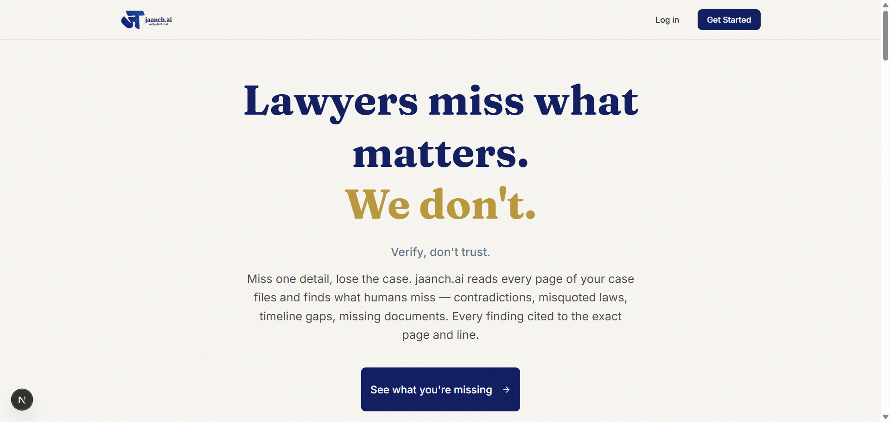

# ज Jaanch — Legal Document Intelligence

<p align="center">
  
</p>

<p align="center">
  <strong>Verify, don't trust.</strong>
</p>

<p align="center">
  <a href="https://jaanch.ai"></a>
  <a href="https://app.jaanch.com"></a>
</p>

**Jaanch** is an *AI-powered legal document intelligence platform* built for Indian lawyers. It reads every page of your case files — 700 pages, 2000 pages, doesn't matter — and finds what humans miss: contradictions, misquoted laws, timeline gaps, and missing documents. Every finding is cited to the exact page and line. No hallucinations. No trust required.

The name "jaanch" (जाँच) is Hindi for *investigation* or *examination*. The product is the investigation — 5 specialized AI engines running in parallel, each doing what a junior associate does at midnight, except it catches everything.

If you want a legal document analysis tool that verifies instead of summarizes, cites instead of guesses, and says "I don't know" instead of making things up — this is it.

[Website](https://jaanch-ai.vercel.app/) · [Backend Docs](./backend/README.md)

## Quick start

Runtime: **Node >= 18** (frontend), **Python >= 3.12** (backend).

```bash
git clone https://github.com/your-org/jaanch.git
cd jaanch

# Frontend
cd frontend
npm install
npm run dev

# Backend (separate terminal)
cd backend
pip install -e .
uvicorn app.main:app --reload
```

Environment variables required for Supabase, OpenAI, Google Cloud, Redis, and Celery. See [Backend README](./backend/README.md) for full setup.

```bash
# Start Celery workers (separate terminal)
celery -A app.workers.celery_app worker --loglevel=info

# Start Celery beat scheduler
celery -A app.workers.celery_app beat --loglevel=info
```

## Why Jaanch (not ChatGPT)?

|  | ChatGPT | Jaanch |
|--|---------|--------|
| **Approach** | Summarizes | Verifies |
| **Citations** | None | Exact page & line |
| **Confidence** | Always high (even when wrong) | Says "I don't know" when unsure |
| **Domain** | Generic | Indian legal documents |
| **Hallucinations** | Prone to them | Evidence-bound only |
| **Act verification** | Not supported | Validates against actual statutes |
| **Documents** | Clean text only | Scanned PDFs, multilingual (Hindi/English) |

## The 5 engines

| Engine | What it does |
|--------|-------------|
| **⏱️ Timeline** | Extracts dates, builds chronology, detects temporal gaps and impossibilities, validates legal sequence ordering |
| **👥 Entities** | Maps people, companies, relationships — resolves aliases (Jaro-Winkler similarity), generates relationship graphs, supports entity merging with correction learning |
| **📜 Citations** | Finds every Act reference via regex + LLM dual extraction, mega-batches (3 chunks/call), parses India Code format (§123(4)), validates against statute database, discovers missing acts |
| **⚔️ Contradictions** | Two-tier detection: Gemini screens all pairs → GPT-4o escalates uncertain results. 100% rule-based scoring ($0 cost). Classifies conflict types, ranks by severity |
| **🔀 Orchestrator** | Intent analysis (regex fast-path + GPT-3.5), parallel engine execution with 30s timeout, result aggregation (4 strategies), language policing integration |

Each engine runs independently on every document and cross-references results via the **cross-engine correlation service**.

## How it works

```
                    Upload (PDF/ZIP)
                         │
                         ▼
              ┌─────────────────────┐
              │    OCR Pipeline     │
              │  (Document AI +     │
              │   Gemini Validator) │
              └──────────┬──────────┘
                         │
                         ▼
              ┌─────────────────────┐
              │  Chunking Pipeline  │
              │  (Parent-Child +    │
              │   Layout-Aware +    │
              │   BBox Linking)     │
              └──────────┬──────────┘
                         │
                         ▼
              ┌─────────────────────┐
              │ Embedding Pipeline  │
              │  (OpenAI + pgvector │
              │   HNSW Upload)      │
              └──────────┬──────────┘
                         │
            ┌────────────┼────────────┐────────────┐
            ▼            ▼            ▼            ▼
      ┌──────────┐ ┌──────────┐ ┌──────────┐ ┌──────────┐
      │ Timeline │ │ Entities │ │ Citations│ │Contradict│
      │  Engine  │ │  Engine  │ │  Engine  │ │  Engine  │
      └────┬─────┘ └────┬─────┘ └────┬─────┘ └────┬─────┘
           │             │            │            │
           └─────────────┼────────────┘────────────┘
                         │
                         ▼
              ┌─────────────────────┐
              │  Orchestrator +     │
              │  Cross-Engine       │
              │  Correlation        │
              └──────────┬──────────┘
                         │
                         ▼
              ┌─────────────────────┐
              │  Summary Generation │
              │  (Gemini Flash)     │
              └──────────┬──────────┘
                         │
            ┌────────────┼────────────┐
            ▼            ▼            ▼
     ┌───────────┐ ┌──────────┐ ┌──────────┐
     │ WebSocket │ │  REST    │ │  Export  │
     │ (live)    │ │  API     │ │  (PDF/   │
     │           │ │          │ │ DOCX/PPT)│
     └───────────┘ └──────────┘ └──────────┘
```

## Everything we built so far

### Core platform

- **FastAPI REST API** with 34 route files and 160+ endpoints: documents, matters, search, chat, citations, contradictions, entities, timeline, verification, summary, anomalies, exports, jobs, dashboard, activity, notifications, library, health, WebSocket, global search, tables, evaluation, inspector, samples, OCR validation, bounding boxes, reasoning traces, session, users, and admin routes (maintenance, pipeline, quota).
- **Celery worker system** with 14 task modules and 60+ tasks: document processing (11-task pipeline chain), chunked document processing (parallel chunk OCR with chord()), engine extraction, chunking, verification, evaluation, table extraction, act validation, email, library indexing, maintenance (15+ recovery/cleanup tasks), reasoning archival (cold storage), embedding migration, quota monitoring. 18 Celery Beat scheduled maintenance tasks.
- **Job tracking system** with progress persistence, stage history, ETA calculation, partial progress for resumable processing, automatic failure recovery, stuck job detection (PROCESSING > threshold), retry/skip/cancel operations, and auto-recovery of stale jobs.
- **Real-time WebSocket layer** with Redis-to-WebSocket bridge for matter-level subscriptions: document status changes, job progress, citation extraction progress, feature availability broadcasts, with heartbeats and reconnection support.

### Document processing pipeline

- **OCR pipeline**: Google Document AI → Gemini-based validation → pattern correction → confidence scoring → bounding box extraction.
- **Chunking pipeline**: PDF format detection and routing → parent-child hierarchical chunking (1750/550 token parent/child) → layout-aware chunking via Docling → O(n) bounding box linking → token counting.
- **Embedding pipeline**: text preparation → OpenAI text-embedding-3-small → pgvector (PostgreSQL HNSW indexes with hybrid BM25 + semantic search) → Redis embedding cache.
- **Table extraction**: detect and extract structured tables from documents.
- **Document handling**: scanned PDFs, mixed Hindi/English, ZIP file extraction, bulk uploads, parallel chunk processing with token bucket rate limiting.

### AI engines

- **Timeline engine**: Gemini Flash date extraction → event classification (7 legal event types) → entity linking → anomaly detection → legal sequence validation.
- **Entity engine**: Gemini-powered named entity extraction → relationship extraction → alias generation (Jaro-Winkler similarity) → entity consolidation → relationship graph building → correction learning from manual fixes.
- **Citation engine**: regex + LLM dual extraction → mega-batching (3 chunks per Gemini call) → India Code format parsing → act index lookup → abbreviation resolution → act validation → cross-reference verification → missing act discovery.
- **Contradiction engine**: two-tier detection (Gemini Flash screens all pairs → GPT-4o escalates only uncertain results) → 100% rule-based scoring ($0 cost) → conflict classification (4+ types) → evidence confidence scoring → severity ranking.
- **Orchestrator engine**: intent analysis (regex fast-path + GPT-3.5 Turbo fallback) → parallel engine execution (30s timeout) → result aggregation (4 strategies: single, merge, ranked, comprehensive) → language policing integration.
- **Cross-engine correlation**: links entities to timeline events, verifies citation consistency, checks for contradictions in cited material, detects multi-engine consistency issues.
- **Summary generation**: Gemini Flash powered executive summaries with subject matter, key issues, current status, parties information, and content safety policing. Cached with 1-hour TTL, supports user edits (preserved separately), and regeneration on demand.
- **Timeline anomaly detection**: automatically detects temporal inconsistencies — gaps in chronology, sequence violations, duplicate events, and statistical outliers. Severity classification (low/medium/high/critical) with dismiss/verify workflow. Dashboard attention banners for unresolved anomalies.
- **Reasoning traces**: complete chain-of-thought reasoning from all engines stored for legal defensibility audit trails. Hot/cold storage with transparent hydration (<5s from cold). Traces linkable to specific findings. Critical for proving AI analysis is court-defensible.

### Verification system

- **Finding verification**: confidence-tiered review workflow (ADR-004) — findings auto-classified as REQUIRED (<70% confidence, blocks export), SUGGESTED (70-90%, warns), or OPTIONAL (>90%, informational). Attorneys approve, reject (with mandatory notes), or flag findings. Bulk operations (up to 100 at a time) with concurrency control.
- **Summary verification**: per-section inline verification of auto-generated summaries — attorneys verify or flag individual sections (subject matter, key issues, timeline, parties) with notes. Verification badge and inline action buttons on hover.
- **Export gating**: two modes — Advisory (default, blocks only <70% unverified findings) and Required (court-ready, blocks ALL pending findings). Export eligibility API checks blocking/warning findings before allowing export.
- **Forensic audit trail**: all decisions recorded with who verified, when, notes (2000 char limit), and original vs adjusted confidence. Required notes on reject/flag for legal compliance.
- **Verification queue UI**: filterable by finding type, confidence tier, and decision status. Ordered by requirement tier (REQUIRED first) then creation date. Bulk approve/reject/flag with notes dialog.

### RAG & search

- **Hybrid search**: BM25 (keyword) + semantic vector search with Reciprocal Rank Fusion (RRF, k=60), 4-layer matter namespace isolation.
- **Reranking**: Cohere Rerank v3.5 for precision.
- **Global search**: cross-matter search across all user documents.
- **Alias-expanded search**: automatically expands entity aliases in queries.
- **Query caching**: semantic query normalization + Redis-backed result caching + session memory.
- **Query rewriting**: LLM-based query rewriting before retrieval for improved recall.
- **Safety**: two-layer protection — GuardrailService (input blocking with prompt injection detection) + LanguagePolicingService (output sanitization with quote preservation). XML prompt boundaries for injection prevention (ADR-001).
- **RAGAS evaluation**: automated RAG quality assessment framework with faithfulness, answer relevancy, and context recall metrics. Supports single QA pair and batch evaluation of golden datasets. Historical results stored for A/B testing and pipeline optimization.
- **Session memory**: per-matter conversation persistence with sliding window (max 20 messages). Automatic archive restore for session continuity. Messages include entity references, source references, and engine traces.
- **Inspector mode**: development-only RAG debugging — exposes BM25 ranks, semantic ranks, RRF scores, reranker scores, and timing breakdowns per search result. Enabled via `INSPECTOR_ENABLED=true`.

### AI/ML integrations

- **Gemini 2.5 Flash**: primary model — RAG generation, chat, date extraction, citation extraction, entity extraction, OCR validation, contradiction screening, summary generation. Supports prefix caching for cost optimization.
- **GPT-4o**: contradiction escalation for uncertain Gemini results, matter summaries.
- **GPT-4o-mini**: safety guardrails, content moderation.
- **GPT-3.5 Turbo**: intent classification in orchestrator (regex fast-path skips LLM when possible).
- **OpenAI Embeddings**: text-embedding-3-small for vector search.
- **Cohere Rerank v3.5**: search result reranking.
- **Google Document AI**: OCR processing.
- **Circuit breaker resilience**: 5 protected services (OpenAI Embeddings, OpenAI Chat, Gemini, Cohere, Document AI) with exponential backoff + jitter, graceful degradation on failure.

### Frontend application

- **Next.js 16.1.5 + React 19.2.3** SPA with App Router.
- **17 Zustand stores**: matter, chat, Q&A panel, upload, upload wizard, workspace, verification, processing, background processing, notifications, activity, split view, PDF split view, features, library, inspector.
- **234 components** (48 UI + 186 feature) across: authentication, document management, upload wizard, citations browser, contradiction explorer, entity graph (XY Flow + Dagre), timeline visualization (list + horizontal + multi-track), summary editor, verification workflow, chat/Q&A with streaming, PDF viewer with bounding box overlay, export builder with drag-to-reorder, dashboard, admin panel, settings, help system, onboarding wizard.
- **39 custom hooks** for data fetching, UI state, feature toggles, and component logic.
- **32 API client modules** for all backend endpoint groups.
- **Export system**: PDF, DOCX, PowerPoint with template selection, custom section ordering, live preview, and section-specific renderers (summary, findings, timeline, entities, citations, contradictions).
- **PDF viewer**: split-view, fullscreen, bounding box overlay for citation highlighting.
- **Entity graph**: interactive force-directed graph with XY Flow, Dagre layout, entity merging, and merge suggestions.
- **Shared legal library**: global repository of reusable legal documents (statutes, precedents, templates). Fuzzy duplicate detection on title/year. Matter-scoped linking includes library documents in matter searches. Cross-matter knowledge sharing.
- **Notification system**: per-user notifications for processing status, uploads, verifications, contradictions (success/info/in_progress/warning/error). Mark-as-read for individual and bulk. Unread count tracking. User isolation via RLS.
- **Activity feed**: permanent per-user event log across all matters — processing started/complete/failed, contradictions found, verifications needed. Separate from notifications (activities are audit logs, notifications are dismissible alerts). Optional matter filtering.
- **Sample case import**: pre-loaded demo cases with sample documents for onboarding. Auto-queues documents for processing pipeline. Prevents duplicate imports per user.
- **Onboarding wizard**: first-time user guided tour with feature discovery and help system. Contextual help tooltips and feedback collection.

### Infrastructure & operations

- **4-layer matter isolation**: Supabase RLS → vector namespace isolation → service layer checks → API layer validation (with timing attack mitigation at 100ms minimum response).
- **Rate limiting** (7 tiers): ADMIN (10/min), EXPORT (20/min), CRITICAL (30/min), SEARCH (60/min), STANDARD (100/min), READONLY (120/min), HEALTH (300/min) — per-user with IP fallback, Redis-backed with in-memory fallback for distributed deployments.
- **3-layer rate limiting**: HTTP (slowapi per-endpoint) → LLM (app-level async semaphore) → Budget ($120/month cap with per-provider tracking).
- **Circuit breakers** (5 services): OpenAI Embeddings, OpenAI Chat, Gemini, Cohere, Document AI — exponential backoff with jitter, graceful degradation, correlation ID tracking.
- **Health checks**: liveness (`/health`), readiness (`/health/ready`), circuit breaker status, rate limit status, dependency health monitoring.
- **Caching**: Redis connection pooling (Upstash), query result caching, session management, matter metadata caching, summary caching (1-hour TTL), embedding caching.
- **Distributed locking**: Redis-backed locks with expiration for deduplication and rate limit enforcement.
- **Cost tracking**: dual currency (INR/USD), 7 provider pricing tables, per-request LLM cost calculation, matter-level rollup, batch aggregation, monthly budget quota monitoring, admin dashboard.
- **Cold storage archival**: reasoning traces >30 days archived to Supabase Storage.
- **Email**: Resend API integration, async Celery-based delivery, HTML templates.
- **Observability**: structlog structured logging, correlation IDs (CorrelationMiddleware), WebSocket connection metrics, processing stage history, cache control headers (5s-120s TTLs).
- **Security**: JWT authentication (HS256 + ES256 with JWKS), 4-layer matter RBAC, WebSocket auth, Supabase RLS multi-tenant isolation, XML prompt boundaries (ADR-001), timing attack mitigation.

### Testing

- **E2E tests** (Playwright): 10 spec files covering authentication, matter creation, document management, chat/Q&A, quick workspace, search navigation, workspace tabs, email notifications, security foundations. 12 page objects with fixtures.
- **Backend tests** (pytest): 163 test files covering API routes, engine tests (citation, contradiction, timeline, orchestrator, RAG), service tests (chunking, RAG, OCR, safety, memory, MIG), integration tests, security tests, and benchmarks.
- **Frontend tests**: 174 unit test files across components, stores, hooks, and utilities.

## Project structure

```
jaanch/
├── frontend/                # Next.js 16.1.5 application
│   ├── src/
│   │   ├── app/                # App Router pages (auth, dashboard, matter workspace)
│   │   ├── components/
│   │   │   ├── ui/             # 48 base UI components (Radix + Tailwind)
│   │   │   └── features/       # 186 feature components across 26 modules
│   │   ├── stores/             # 17 Zustand stores
│   │   ├── hooks/              # 39 custom React hooks
│   │   ├── lib/                # Utilities, 32 API client modules, constants
│   │   └── types/              # TypeScript type definitions
│   └── tests/
│       ├── e2e/                # Playwright E2E tests (10 specs + 12 page objects)
│       └── unit/               # 174 unit test files
│
├── backend/                 # FastAPI application
│   ├── app/
│   │   ├── api/
│   │   │   └── routes/         # 34 API route files (160+ endpoints)
│   │   ├── core/               # Config, security, rate limiting, circuit breakers, cost tracking
│   │   ├── engines/            # 5 engines (RAG, citation, timeline, contradiction, orchestrator)
│   │   ├── services/           # 60+ services across 16 subdirs (RAG, OCR, chunking, safety, etc.)
│   │   ├── models/             # Pydantic models
│   │   └── workers/
│   │       └── tasks/          # 14 Celery task modules (60+ tasks)
│   └── tests/                  # pytest test suite (163 test files)
│
└── docs/                    # Documentation and planning
```

## Team

Jaanch was built by **Juhi Nebhnani** and **Siddhi Maheshwari**.

Part of the [100xEngineers](https://100xengineers.com) program.

- [jaanch.ai](https://jaanch-ai.vercel.app/)
