# Jaanch AI — Architecture Diagrams (Mermaid)

> Generated for debugging and personal understanding.
> Open in any Mermaid-compatible viewer (VS Code, GitHub, Notion, mermaid.live).

---

## 1. High-Level System Architecture

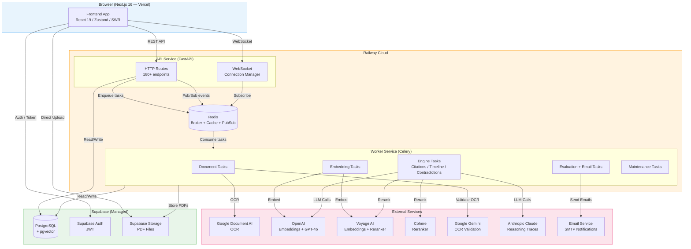

---

## 2. Backend Module Map

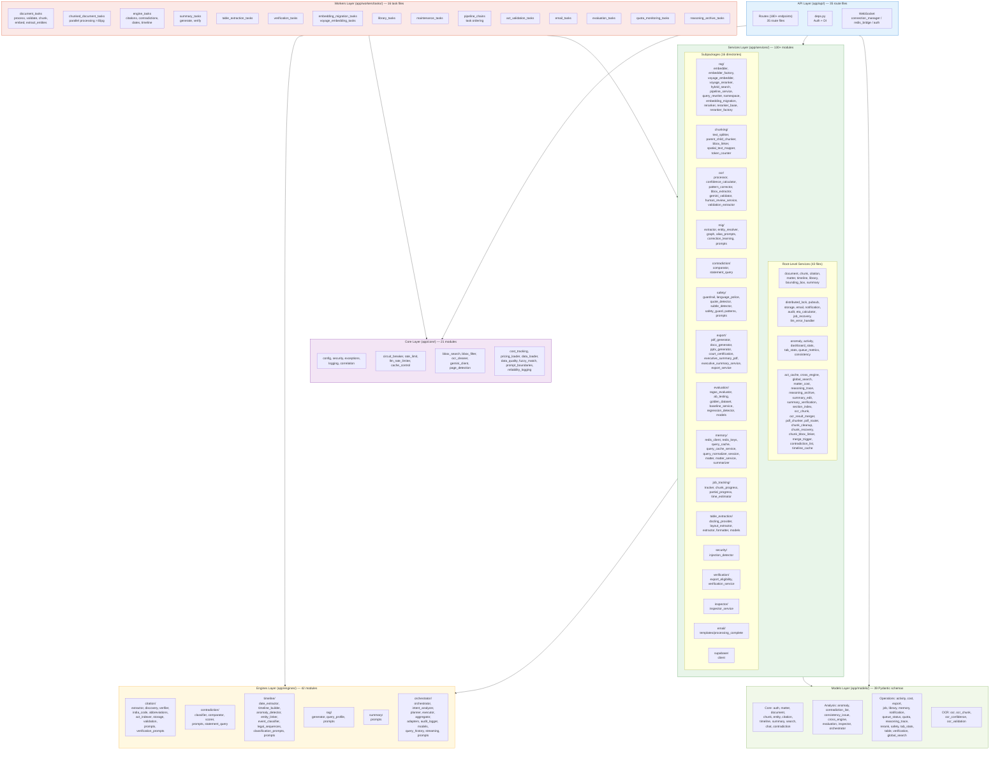

---

## 3. Document Processing Pipeline

### 3a. Small Documents (< 30 pages) — Celery Chain

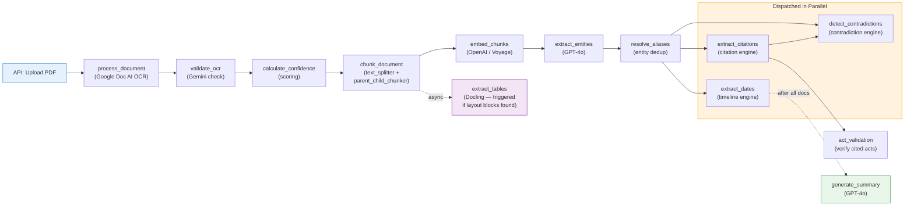

### 3b. Large Documents (> 30 pages) — Chunked Parallel Processing

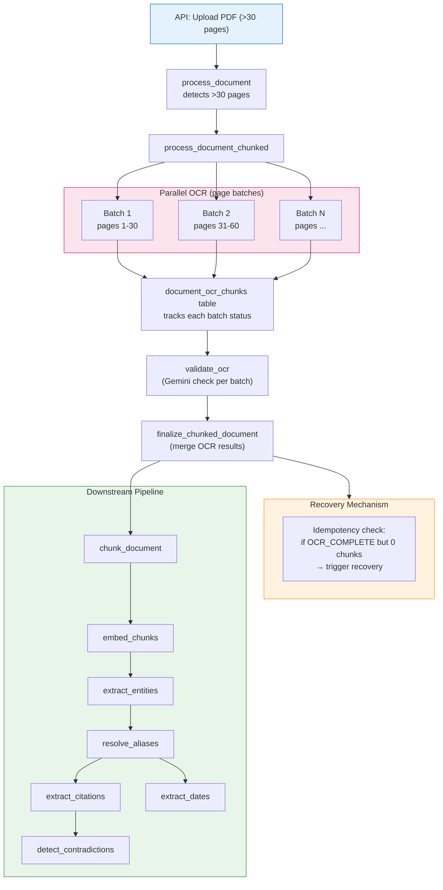

---

## 4. Frontend Architecture

### 4a. Page Routes & Navigation

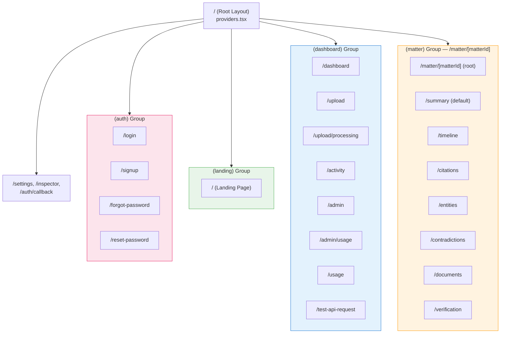

### 4b. State Management & Data Flow

```mermaid
graph TB
    subgraph ZUSTAND["Zustand Stores (17)"]
        MS["matterStore<br/>current matter + workspace"]
        CS["chatStore<br/>Q&A conversations"]
        WS_STORE["workspaceStore<br/>active tab"]
        US["uploadStore +<br/>uploadWizardStore"]
        PS["processingStore +<br/>backgroundProcessingStore"]
        VS["verificationStore"]
        NS["notificationStore"]
        QAS["qaPanelStore"]
        SPLITS["splitViewStore +<br/>pdfSplitViewStore"]
        OTHERS["modelStore, libraryStore,<br/>featureStore, inspectorStore,<br/>activityStore"]
    end

    subgraph HOOKS["Custom Hooks (42)"]
        AUTH_HOOK["Auth: useAuth, useSession"]
        DATA_HOOKS["Data: useMatterSummary, useCitations,<br/>useEntities, useTimeline,<br/>useContradictions, useDocuments,<br/>useBoundingBoxes, useLiveDiscoveries"]
        REALTIME["Realtime: useSSE, useWebSocket"]
        ADMIN_HOOKS["Admin: useAdminStatus, useLLMQuota,<br/>useQueueStatus, useUsageDashboard,<br/>useUsageSummary, useServiceHealth"]
        MONITORING_HOOKS["Monitoring: useProcessingStatus,<br/>useDocumentStatus, useChunkMetrics,<br/>useQualityMetrics"]
        SEARCH_HOOKS["Search: useActDiscovery,<br/>useCrossEngine, useAnomalies"]
        VERIFY_HOOKS["Verification: useSummaryVerification,<br/>useVerificationActions,<br/>useVerificationQueue,<br/>useVerificationStats"]
        EXPORT_HOOKS["Export: useExportBuilder,<br/>useExportGeneration"]
        COST_HOOKS["Cost: useMatterCosts"]
        UI_HOOKS["UI: useSplitView, useCrossTabNavigation,<br/>useSummaryEdit, useUserPreferences,<br/>useUserProfile, useInspector"]
        FLAG_HOOKS["Feature: useFeatureSubscription,<br/>usePowerUserMode, useABTesting,<br/>useTimelineStats"]
    end

    subgraph API_CLIENT["API Client (lib/api/) — 34 modules"]
        CLIENT["client.ts<br/>Token injection + refresh<br/>30s timeout + error handling"]
        MODULES["chat, citations, documents,<br/>entities, matters, search,<br/>timeline, verifications,<br/>bounding-boxes, chunks,<br/>globalSearch, crossEngine"]
        ADMIN_MODULES["admin-monitoring, admin-pipeline,<br/>admin-queue, admin-quota,<br/>admin-usage, admin-maintenance"]
        OPS_MODULES["upload-orchestration, ab-testing,<br/>tabStats, costs, usage,<br/>evaluation, exports, jobs,<br/>library, notifications,<br/>activity, samples"]
    end

    subgraph EXTERNAL_STATE["External State"]
        SWR["SWR Cache<br/>HTTP-level caching"]
        SUPA_AUTH["Supabase Auth<br/>JWT session"]
        LS["localStorage<br/>preferences"]
    end

    ZUSTAND --> HOOKS
    HOOKS --> API_CLIENT
    API_CLIENT --> SWR
    API_CLIENT --> SUPA_AUTH
    ZUSTAND -.->|"persist"| LS

    style ZUSTAND fill:#e3f2fd,stroke:#1976D2
    style HOOKS fill:#f3e5f5,stroke:#7B1FA2
    style API_CLIENT fill:#fff3e0,stroke:#FF9800
    style EXTERNAL_STATE fill:#e8f5e9,stroke:#388E3C
```

### 4c. Matter Workspace Component Tree

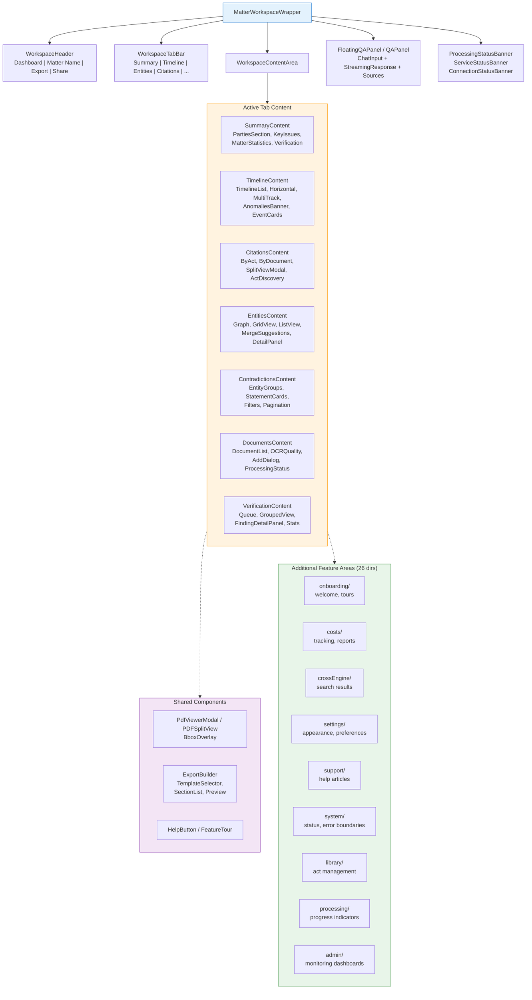

---

## 5. Data Model (ER Diagram)

> **Full-detail version:** See [`docs/schema.dbml`](schema.dbml) — paste into [dbdiagram.io](https://dbdiagram.io) for an interactive, zoomable diagram with all columns, constraints, and ON DELETE behaviors.

```mermaid
erDiagram
    users ||--o{ matter_attorneys : "assigned to"
    users ||--o{ documents : "uploaded_by"
    users ||--o{ library_documents : "added_by"
    users ||--o{ alias_corrections : "corrected_by"
    users ||--o{ activities : "performed"
    users ||--o{ notifications : "receives"
    users ||--o{ exports : "created_by"
    users ||--o{ finding_verifications : "verified_by_user"
    users ||--|| user_preferences : "has preferences"

    matters ||--o{ matter_attorneys : "has members"
    matters ||--o{ documents : "contains"
    matters ||--o{ chunks : "contains"
    matters ||--o{ bounding_boxes : "contains"
    matters ||--o{ identity_nodes : "has entities"
    matters ||--o{ citations : "has citations"
    matters ||--o{ events : "has events"
    matters ||--o{ findings : "has findings"
    matters ||--o{ statement_comparisons : "has comparisons"
    matters ||--o{ processing_jobs : "has jobs"
    matters ||--o{ matter_memory : "has memory"
    matters ||--o{ act_resolutions : "has act refs"
    matters ||--o{ matter_library_links : "linked to library"
    matters ||--o{ document_ocr_chunks : "tracks OCR batches"
    matters ||--o{ anomalies : "has anomalies"
    matters ||--o{ alias_corrections : "has corrections"
    matters ||--o{ summary_verifications : "has summary checks"
    matters ||--o{ summary_notes : "has summary notes"
    matters ||--o{ summary_edits : "has summary edits"
    matters ||--o{ golden_dataset : "has test data"
    matters ||--o{ evaluation_results : "has evaluations"
    matters ||--o{ reasoning_traces : "has traces"
    matters ||--o{ exports : "has exports"
    matters ||--o{ ocr_human_review : "has OCR reviews"
    matters ||--o{ matter_query_history : "has query history"
    matters ||--o{ finding_verifications : "has finding checks"
    matters ||--o{ document_tables : "has extracted tables"
    matters ||--o{ section_index : "has section index"
    matters ||--o{ consistency_issues : "has consistency issues"
    matters ||--o{ ab_test_runs : "has A/B tests"

    documents ||--o{ chunks : "split into"
    documents ||--o{ bounding_boxes : "has bboxes"
    documents ||--o{ entity_mentions : "mentioned in"
    documents ||--o{ events : "source of"
    documents ||--o{ document_ocr_chunks : "split into OCR batches"
    documents ||--o{ ocr_validation_log : "validated"
    documents ||--o{ ocr_human_review : "reviewed"
    documents ||--o{ document_tables : "has tables"
    documents ||--o{ section_index : "has sections"
    documents ||--o{ toc_pages : "has TOC pages"

    chunks ||--o{ chunks : "parent_chunk_id"
    chunks ||--o{ entity_mentions : "chunk_id"

    identity_nodes ||--o{ identity_edges : "source_node"
    identity_nodes ||--o{ identity_edges : "target_node"
    identity_nodes ||--o{ entity_mentions : "entity_id"
    identity_nodes ||--o{ alias_corrections : "corrected entity"

    citations }o--|| documents : "source_document_id"
    citations }o--o| documents : "target_act_document_id"

    processing_jobs ||--o{ job_stage_history : "has stages"

    library_documents ||--o{ library_chunks : "split into"
    library_documents ||--o{ matter_library_links : "linked from"

    library_chunks ||--o{ library_chunks : "parent_chunk_id"

    findings ||--o{ reasoning_traces : "explained by"
    findings ||--o{ finding_verifications : "verified by"

    golden_dataset ||--o{ evaluation_results : "evaluated by"
    ab_test_runs }o--|| matters : "test matter_id"

    act_resolutions }o--o| act_validation_cache : "validated by cache"

    consistency_issues }o--o| documents : "issue document_id"

    bounding_boxes ||--o{ ocr_validation_log : "corrected bbox"

    llm_costs }o--o| matters : "cost matter_id"
    llm_costs }o--o| documents : "cost document_id"

    audit_logs }o--o| users : "audit user_id"
    audit_logs }o--o| matters : "audit matter_id"

    users {
        uuid id PK
        text email
        text full_name
    }

    matters {
        uuid id PK
        text title
        text description
        text status "active|archived|closed"
        text cause_title
    }

    matter_attorneys {
        uuid id PK
        uuid matter_id FK
        uuid user_id FK
        text role "owner|editor|viewer"
    }

    documents {
        uuid id PK
        uuid matter_id FK
        text filename
        text storage_path
        text document_type "case_file|act|annexure|other"
        text status "pending|processing|completed|failed"
        int page_count
    }

    chunks {
        uuid id PK
        uuid matter_id FK
        uuid document_id FK
        uuid parent_chunk_id FK
        int chunk_index
        text content
        vector embedding "vector(1536)"
        text chunk_type "parent|child|table"
        int page_number
        int token_count
        int text_start_offset
        int text_end_offset
    }

    bounding_boxes {
        uuid id PK
        uuid matter_id FK
        uuid document_id FK
        int page_number
        float x
        float y
        float width
        float height
        text text_content
        float confidence
    }

    identity_nodes {
        uuid id PK
        uuid matter_id FK
        text canonical_name
        text entity_type "person|organization|location|..."
        text_arr aliases
        int mention_count
    }

    identity_edges {
        uuid id PK
        uuid matter_id FK
        uuid source_node_id FK
        uuid target_node_id FK
        text relationship_type
        float confidence
    }

    entity_mentions {
        uuid id PK
        uuid entity_id FK
        uuid document_id FK
        uuid chunk_id FK
        int page_number
        text mention_text
        float confidence
    }

    citations {
        uuid id PK
        uuid matter_id FK
        uuid source_document_id FK
        uuid target_act_document_id FK
        text act_name
        text section
        text quoted_text
        int source_page
        text verification_status "verified|mismatch|not_found|pending"
        float confidence
    }

    events {
        uuid id PK
        uuid matter_id FK
        uuid document_id FK
        date event_date
        text event_date_precision "day|month|year|approximate"
        text event_type "filing|hearing|contract|..."
        text description
        float confidence
        boolean is_manual
    }

    findings {
        uuid id PK
        uuid matter_id FK
        text engine_type "citation|timeline|contradiction"
        text finding_type
        jsonb content
        float confidence
        text status "pending|verified|rejected"
    }

    statement_comparisons {
        uuid id PK
        uuid matter_id FK
        uuid entity_id
        uuid statement_a_id
        uuid statement_b_id
        text result "contradiction|consistent|uncertain"
        numeric confidence
        text contradiction_type
        text reasoning
    }

    processing_jobs {
        uuid id PK
        uuid matter_id FK
        uuid document_id FK
        text job_type
        text status "QUEUED|PROCESSING|COMPLETED|FAILED"
        text celery_task_id
        int progress_pct
    }

    job_stage_history {
        uuid id PK
        uuid job_id FK
        text stage_name
        text status
    }

    matter_memory {
        uuid id PK
        uuid matter_id FK
        text memory_type "query_history|timeline_cache|entity_graph|..."
        jsonb data
    }

    act_resolutions {
        uuid id PK
        uuid matter_id FK
        uuid act_document_id FK
        text act_name_normalized
        text resolution_status "available|missing|skipped"
        text user_action "uploaded|skipped|pending"
        int citation_count
    }

    library_documents {
        uuid id PK
        text filename
        text title
        text short_title
        text document_type "act|statute|judgment|..."
        int year
        text status "pending|processing|completed|failed"
    }

    library_chunks {
        uuid id PK
        uuid library_document_id FK
        uuid parent_chunk_id FK
        int chunk_index
        text content
        vector embedding "vector(1536)"
        text chunk_type "parent|child|table"
        int page_number
    }

    matter_library_links {
        uuid id PK
        uuid matter_id FK
        uuid library_document_id FK
        uuid linked_by FK
    }

    document_ocr_chunks {
        uuid id PK
        uuid matter_id FK
        uuid document_id FK
        int chunk_index
        int page_start
        int page_end
        text status "pending|processing|completed|failed"
        text ocr_full_text
    }

    anomalies {
        uuid id PK
        uuid matter_id FK
        text anomaly_type "gap|sequence_violation|duplicate|outlier"
        text severity "low|medium|high|critical"
        text title
        text explanation
        float confidence
        boolean verified
        boolean dismissed
    }

    alias_corrections {
        uuid id PK
        uuid matter_id FK
        uuid entity_id FK
        text correction_type "add|remove|merge"
        text alias_name
        uuid corrected_by FK
        jsonb metadata "immutable audit record"
    }

    summary_verifications {
        uuid id PK
        uuid matter_id FK
        text section_type "parties|subject_matter|current_status|key_issue"
        text section_id
        text decision "verified|flagged"
        uuid verified_by FK
    }

    summary_notes {
        uuid id PK
        uuid matter_id FK
        text section_type "parties|subject_matter|current_status|key_issue"
        text section_id
        text text
        uuid created_by FK
    }

    summary_edits {
        uuid id PK
        uuid matter_id FK
        text section_type "parties|subject_matter|current_status|key_issue"
        text section_id
        text original_content
        text edited_content
        uuid edited_by FK
    }

    activities {
        uuid id PK
        uuid user_id FK
        uuid matter_id FK "nullable"
        text type "processing_complete|contradictions_found|..."
        text description
        boolean is_read
    }

    notifications {
        uuid id PK
        uuid user_id FK
        uuid matter_id FK "nullable"
        text type "success|info|warning|error|in_progress"
        text title
        text message
        text priority "high|medium|low"
        boolean is_read
    }

    golden_dataset {
        uuid id PK
        uuid matter_id FK
        text question
        text expected_answer
        uuid created_by FK
    }

    evaluation_results {
        uuid id PK
        uuid matter_id FK
        uuid golden_item_id FK
        text question
        text answer
        float overall_score
        float context_recall
        float faithfulness
        float answer_relevancy
        text triggered_by "manual|auto|batch"
        jsonb pipeline_config
    }

    llm_costs {
        uuid id PK
        uuid matter_id FK "nullable — ON DELETE SET NULL"
        uuid document_id FK "nullable"
        text provider
        text operation
        int input_tokens
        int output_tokens
        numeric total_cost_inr
        numeric total_cost_usd
        int duration_ms
    }

    audit_logs {
        uuid id PK "NO RLS — service role only"
        text event_type
        uuid user_id FK "nullable"
        uuid matter_id FK "nullable"
        text action
        text result "success|denied|error|blocked"
        text path
        text method
        jsonb details
    }

    reasoning_traces {
        uuid id PK "immutable once created"
        uuid matter_id FK
        uuid finding_id FK "nullable"
        text engine_type "citation|timeline|contradiction|rag|entity"
        text model_used
        text reasoning_text
        float confidence_score
        int tokens_used
        text archive_path "cold storage path"
    }

    exports {
        uuid id PK
        uuid matter_id FK
        text format "pdf|docx|pptx"
        text status "pending|processing|completed|failed"
        text file_path
        uuid created_by FK
        jsonb verification_summary
    }

    user_preferences {
        uuid user_id PK
        boolean email_notifications_processing
        boolean email_notifications_verification
        text theme "light|dark|system"
    }

    ocr_validation_log {
        uuid id PK "immutable 7-year audit trail"
        uuid document_id FK
        uuid bbox_id FK "nullable"
        text original_text
        text corrected_text
        text validation_type "pattern|gemini|human"
        text reasoning
    }

    ocr_human_review {
        uuid id PK
        uuid document_id FK
        uuid matter_id FK
        uuid bbox_id FK "nullable"
        int page_number
        text status "pending|completed|skipped"
        text corrected_text
        uuid reviewed_by FK
    }

    matter_query_history {
        uuid id PK "append-only forensic"
        uuid matter_id FK
        uuid query_id
        jsonb audit_data "full QueryAuditEntry"
    }

    finding_verifications {
        uuid id PK
        uuid matter_id FK
        uuid finding_id FK "nullable"
        text finding_type
        text decision "pending|approved|rejected|flagged"
        float confidence_before
        float confidence_after "nullable"
        uuid verified_by FK
        text notes
    }

    document_tables {
        uuid id PK
        uuid document_id FK
        uuid matter_id FK
        int table_index
        int page_number
        text markdown_content
        jsonb json_content
        int row_count
        int col_count
        float confidence
    }

    section_index {
        uuid id PK
        uuid document_id FK
        uuid matter_id FK
        text section_number
        int page_number
        float confidence
        boolean is_toc
        text section_title
    }

    toc_pages {
        uuid id PK
        uuid document_id FK
        int page_number
        float confidence
        text detected_via
    }

    act_validation_cache {
        uuid id PK "global — shared across matters"
        text act_name_normalized "unique"
        text act_name_canonical
        int act_year
        text india_code_url
        text validation_status "valid|invalid|state_act|not_on_indiacode|unknown"
    }

    llm_quota_limits {
        uuid id PK
        varchar provider "unique"
        bigint daily_token_limit
        bigint monthly_token_limit
        numeric daily_cost_limit_inr
        numeric monthly_cost_limit_inr
        int alert_threshold_pct
    }

    consistency_issues {
        uuid id PK
        uuid matter_id FK
        text issue_type "date_mismatch|entity_name_mismatch|amount_discrepancy|..."
        text severity "info|warning|error"
        text source_engine "timeline|entity|citation|contradiction|rag"
        text conflicting_engine
        text description
        uuid document_id FK "nullable"
        text status "open|reviewed|resolved|dismissed"
    }

    ab_test_runs {
        uuid id PK
        uuid matter_id FK
        text status "pending|running_control|running_treatment|comparing|completed|failed"
        text control_embedding "default openai"
        text treatment_embedding "default voyage"
        jsonb control_scores
        jsonb treatment_scores
        text decision "control_wins|treatment_wins|no_significant_difference"
        float decision_confidence
    }
```

---

## 6. API Routes Map

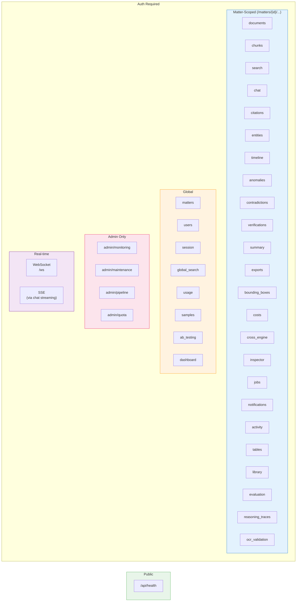

---

## 7. RAG Pipeline Detail

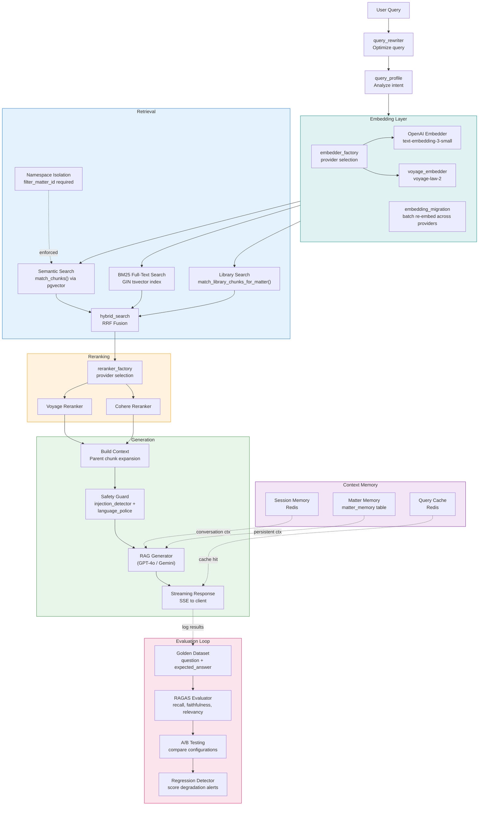

---

## 8. Security & Isolation Model

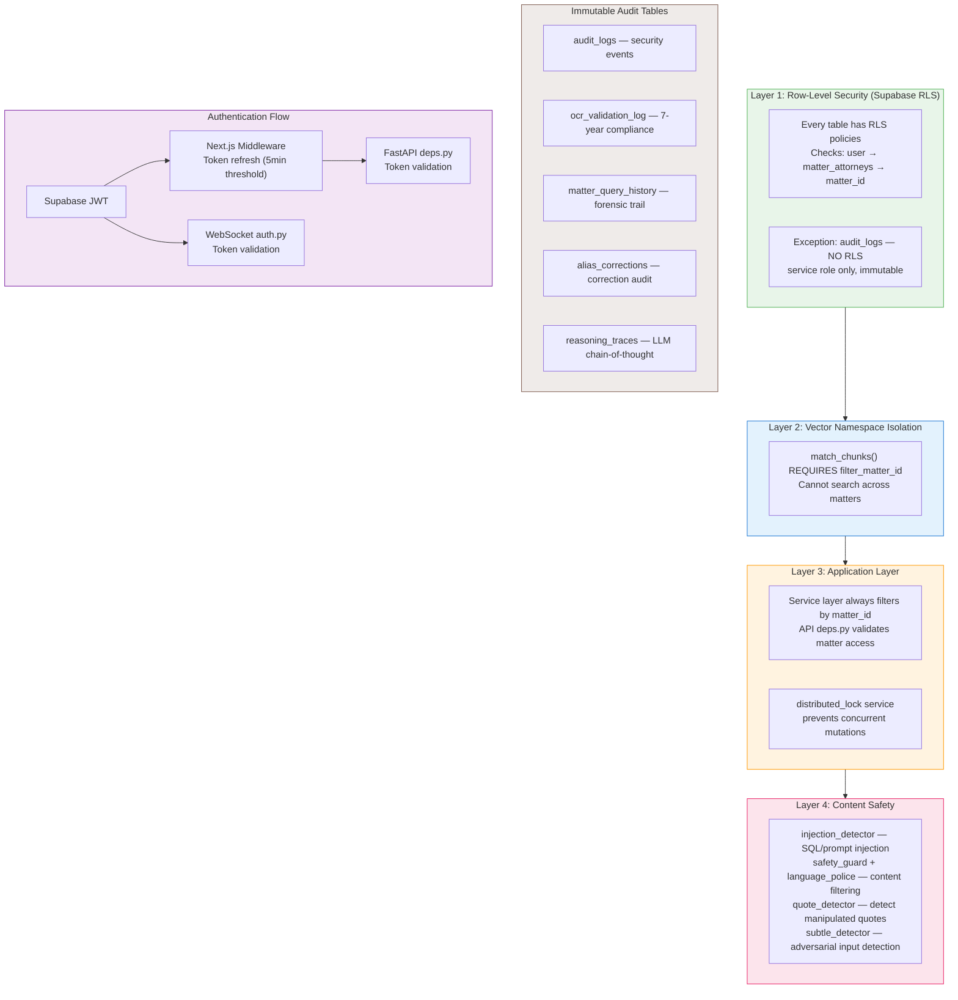
